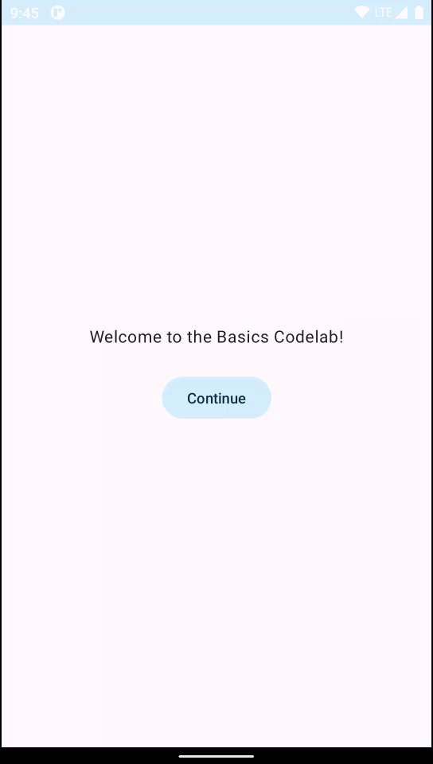

# [Jetpack Compose basics](https://developer.android.com/codelabs/jetpack-compose-basics)

updated Jul 13, 2023

Written by a Googler

### 1. Before you begin

[Jetpack Compose](https://developer.android.com/jetpack/compose) is a modern toolkit designed to
simplify UI development. It combines a reactive programming model with the conciseness and ease of
use of the Kotlin programming language. It is fully declarative, meaning you describe your UI by
calling a series of functions that transform data into a UI hierarchy. When the underlying data
changes, the framework automatically re-executes these functions, updating the UI hierarchy for you.

A Compose app is made up of composable functions - just regular functions marked with @Composable,
which can call other composable functions. A function is all you need to create a new UI component.
The annotation tells Compose to add special support to the function for updating and maintaining
your UI over time. Compose lets you structure your code into small chunks. Composable functions are
often referred to as "composables" for short.

By making small reusable composables, it's easy to build up a library of UI elements used in your
app. Each one is responsible for one part of the screen and can be edited independently.

> **Note**: In this codelab, the terms "UI Components," "Composable functions," and "composables"
> are used interchangeably to refer to the same concept.

For more support as you're walking through this codelab, check out the following code-along:

**Note**: The code-along uses Material 2 while the codelab is updated to use Material 3. Be aware
that there will be some steps where they are different.

#### Prerequisites

* Experience with Kotlin syntax, including lambdas

#### What you'll do

In this codelab, you will learn:

* What Compose is
* How to build UIs with Compose
* How to manage state in composable functions
* How to create a performant list
* How to add animations
* How to style and theme an app

You'll build an app with an onboarding screen, and a list of animated expanding items:

#### What you'll need

* [Latest Android Studio](https://developer.android.com/studio)